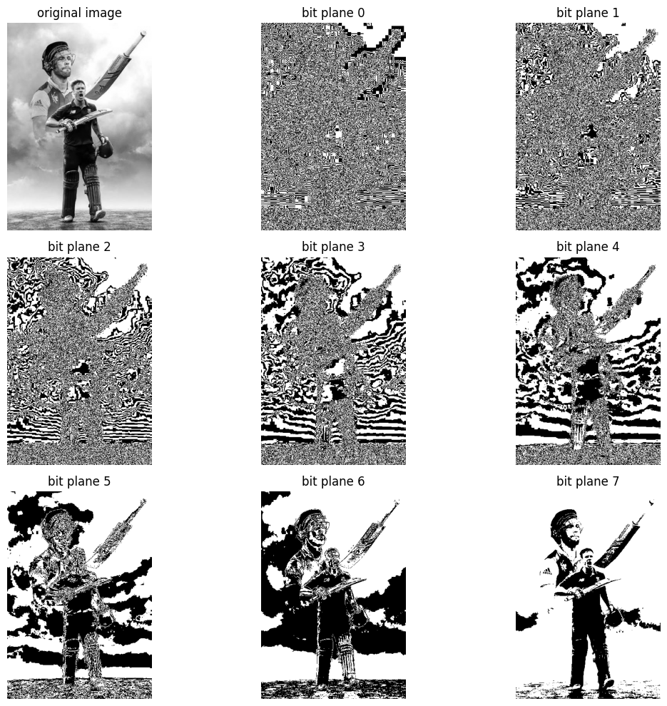

# Bit Plane Slicing

## Aim

To perform **Bit Plane Slicing** on a grayscale image and display all 8 bit planes separately to understand the contribution of each bit to the original image.

## Output

The output shows the original grayscale image and its **8 bit planes (Bit Plane 0 to Bit Plane 7)**.

### Output Image

## Result

The grayscale image was successfully decomposed into **8 individual bit planes**. The lower bit planes mainly contain fine details and noise, while the higher bit planes contain more significant information about the image structure.
